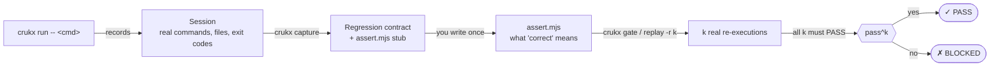
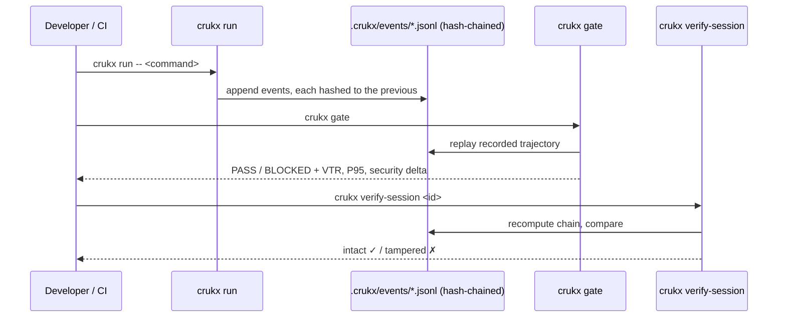
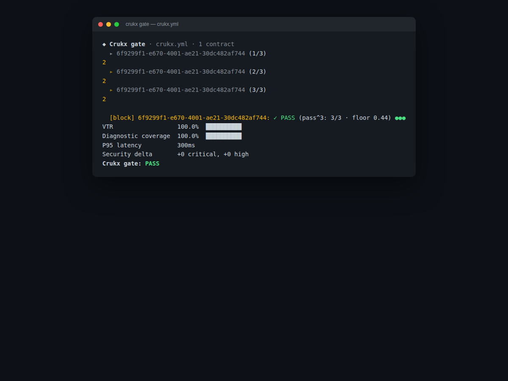
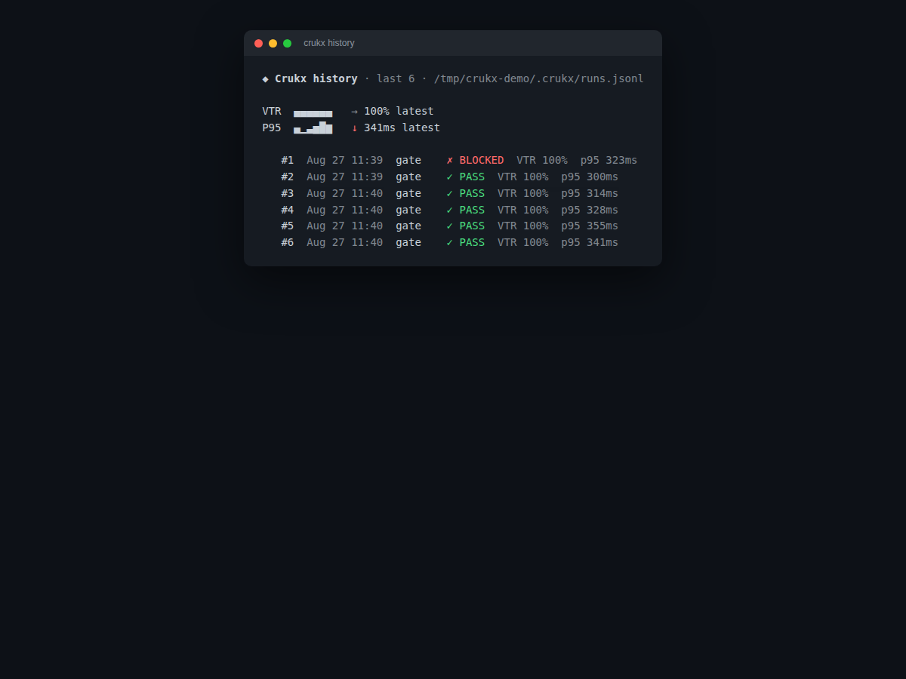

# Crukx CLI

**A release gate for AI-written software.** `crukx gate` replays a
recorded agent session against a regression contract, checks it
against reliability/security/latency constraints, and blocks the
release when they aren't met — deterministically, offline, with no
account required.

```
crukx run -- npm test       # record a real session
crukx capture                # turn it into a regression contract
crukx gate                   # PASS/BLOCK against crukx.yml
```

## Why Crukx is fast — and why "PASS" actually means something

Most AI-output checkers grade a single response with an LLM judge and
call it reliability. That's cheap and it's also why "looks right" ships
bugs: one run passing tells you nothing about whether the *next* run
of the same workflow will too.

Crukx replays the **real recorded trajectory** — actual shell commands,
actual file writes, actual exit codes — against an assertion you write
once. A contract can be replayed `k` times (`replay <id> -r 5`), and
gate reports **pass^k**: every one of the `k` real re-executions must
pass, not just one out of `k`. A workflow that's flaky 1 time in 5 is
not "80% reliable" here — it's a contract you haven't earned a PASS on
yet. That's the whole difference: nothing here is simulated, sampled,
or judge-scored — every metric on the gate report traces back to a
real process that actually ran.



## What `crukx gate` actually checks

All configured via `crukx.yml`, all optional:

| Constraint | What it checks |
|---|---|
| `vtr_minimum` | Fraction of contracts that PASSed (Verified Trajectory Rate) |
| `diagnostic_coverage_minimum` | Fraction of BLOCKs localized to a specific pipeline stage, not just "something broke" |
| `judge_max_agreement_drop` | LLM-judge drift vs. its own calibration baseline |
| `security_critical_delta_max` / `security_high_delta_max` | New security findings introduced by this change |
| `p95_latency_max_ms` | P95 wall-clock time across replayed steps, from real timing |
| per-contract `repeat: k` | pass^k — see above |

## Tamper-evident by default

Every recorded session's event log is hash-chained. `crukx
verify-session <id>` proves the log hasn't been edited since `crukx
run` wrote it — so a gate result can't be quietly rewritten after the
fact to turn a BLOCK into a PASS.



## See it run

**`crukx gate`** — three real replays of a contract, pass^3, then the
full metric readout:



**`crukx history`** — sparkline trends across recent gate/replay runs,
no dashboard needed:



## Install

```bash
cargo install --path crates/crukx-cli   # requires access to the private engine crate — see below
```

Prebuilt binaries (no build step, no private access needed) are the
intended path for everyone else — published to crates.io / npm / Homebrew.
Until that lands, build from a release tarball on the
[Releases page](https://github.com/Crukx-dev/CrukxCLI/releases) once
published.

## Repo layout — what's here, what isn't

```
crates/
├── crukx-cli/   command entry points, terminal UI/colors, the crukx.yml gate runner
├── crukx-tui/   Ratatui session explorer (crukx review)
└── crukx-git/   thin git wrappers: repo root, HEAD, tracked diff, sha256

packages/
└── crukx-js/    npm shim
```

This repo is the CLI shell — everything you interact with at the
command line. The reliability-gating **engine** underneath it (the
contract/replay model, pass^k/VTRk consistency math, evidence graph,
escalation policy, hash-chain implementation) lives in a private
dependency and isn't published here. That's deliberate: the CLI's
behavior is fully documented above and the binary is exactly what runs
in your CI, but the engine that decides PASS/BLOCK is Crukx's, not
forked. `Cargo.toml` in `crates/crukx-cli` and `crukx-tui` names the
private crate for transparency — it just isn't one you can `git clone`.

## Running the tests

```bash
cargo test -p crukx-cli -p crukx-tui -p crukx-git
```

Covers everything that ships in this repo: the CLI's command surface,
terminal rendering, and git glue. The engine's own test suite runs in
its private repo.
